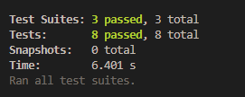
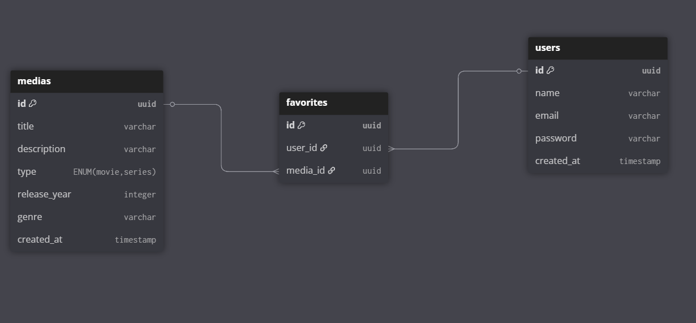

## API Cinemais — Gerenciamento de Catálogo de Mídias

### Descrição do Projeto

* A API Cinemais é uma aplicação simplificada que simula o gerenciamento do catálogo de mídias de uma plataforma de streaming.

### Vídeo Demonstrativo das Funcionalidades

- LINK: https://youtu.be/tSNGeNNrsDU

### Como Rodar o Projeto

1. Configure o arquivo `.env`, valores de exemplo:

   ```
   NODE_ENV = "dev"
   PORT = 3334
   PG_HOST = "db"
   PG_PORT = 5432
   PG_USERNAME = "root"
   PG_DATABASE = "teste"
   PG_PASSWORD = "root"
   JWT_SECRET_KEY = "superscrtkey"
   ```

2. Na raiz do projeto, execute:

   ```
   docker compose up
   ```

### Como Rodar os Testes

1. Na raiz do projeto, execute:

   ```
   pnpm test
   ```

   ou

   ```
   npm run test
   ```

   

### Diagrama do Banco de Dados



### Tecnologias Utilizadas

* TypeScript
* **Fastify** — Escolhi o Fastify em vez do NestJS pela sua simplicidade e leveza, sendo ideal para projetos menores, sem comprometer a organização e a estrutura do código. Além disso, o Fastify oferece alta performance com menor complexidade de configuração.
* **PostgreSQL** — Optei pelo Postgres por ser um banco relacional, o que facilita a realização de joins entre tabelas.
* TypeORM
* Jest (testes unitários)
* Zod (validação dos dados de entrada)
* JWT (autenticação)

---

### Endpoints

#### /auth

* **POST /login**

  * Payload:

    ```
    {
        "email": "teste@gmail.com",
        "password": "teste123"
    }
    ```
  * Exemplos de resposta:

    ```
    200 - OK
    {
        "userId": "1e6c6c05-4d5f-4cb6-bb5a-c35dc0bd1868",
        "accessToken": "eyJhbGciOi..."
    }
    ```

    ```
    400 - Bad Request
    {
        "status": 400,
        "message": "Usuário já cadastrado!"
    }
    ```

* **POST /register**

  * Payload:

    ```
    {
        "email": "teste3@gmail.com",
        "password": "teste123",
        "name": "teste"
    }
    ```
  * Exemplos de resposta:

    ```
    201 - Created
    {
        "createdUser": {
            "email": "teste3@gmail.com",
            "name": "teste",
            "id": "ad517937-9418-4fc3-89e9-c16a939f26e0",
            "createdAt": "2025-07-21T00:45:55.245Z"
        },
        "accessToken": "eyJhbGciOi..."
    }
    ```

    ```
    400 - Bad Request
    {
        "status": 400,
        "message": "Usuário já cadastrado!"
    }
    ```

---

#### /media

* **Headers:**

  * Authorization: `Bearer ${accessToken}`

* **POST /** — Cria uma nova mídia

  * Payload:

    ```
    {
        "title": "Teste 2",
        "releaseYear": 2025,
        "description": "Filme teste 2",
        "type": "movie",
        "genre": "Ficcao"
    }
    ```
  * Exemplos de resposta:

    ```
    201 - Created
    {
        "title": "Teste 2",
        "description": "Filme teste 2",
        "type": "movie",
        "releaseYear": 2025,
        "genre": "Ficcao",
        "id": "a61c3791-aa17-4199-aab4-16701a4e3c88",
        "createdAt": "2025-07-21T00:15:39.704Z"
    }
    ```

    ```
    400 - Bad Request
    {
        "status": 400,
        "message": "Mídia já cadastrada no catálogo!"
    }
    ```

* **GET /** — Busca todas as mídias do catálogo

  * Query Params:

    * `page` (opcional — padrão: 1)
    * `limit` (opcional — padrão: 10)
  * Exemplo de resposta:

    ```
    200 - OK
    [
        {
            "id": "ecd3b16b-6792-431a-a904-34ad637b0510",
            "title": "Teste",
            "description": "Filme teste",
            "type": "movie",
            "releaseYear": 2025,
            "genre": "Ficcao",
            "createdAt": "2025-07-20T23:47:28.936Z"
        },
        {
            "id": "a61c3791-aa17-4199-aab4-16701a4e3c88",
            "title": "Teste 2",
            "description": "Filme teste 2",
            "type": "movie",
            "releaseYear": 2025,
            "genre": "Ficcao",
            "createdAt": "2025-07-21T00:15:39.704Z"
        }
    ]
    ```

* **GET /\:id** — Busca uma mídia específica pelo ID

  * Exemplos de resposta:

    ```
    200 - OK
    {
        "id": "ecd3b16b-6792-431a-a904-34ad637b0510",
        "title": "Teste",
        "description": "Filme teste",
        "type": "movie",
        "releaseYear": 2025,
        "genre": "Ficcao",
        "createdAt": "2025-07-20T23:47:28.936Z"
    }
    ```

    ```
    404 - Not Found
    {
        "status": 404,
        "message": "Mídia não encontrada!"
    }
    ```

---

#### /users

* **Headers:**

  * Authorization: `Bearer ${accessToken}`

* **POST /\:userId/favorites** — Adiciona uma mídia à lista de favoritos

  * Payload:

    ```
    {
        "mediaId": "ecd3b16b-6792-431a-a904-34ad637b0510"
    }
    ```
  * Exemplos de resposta:

    ```
    204 - No Content
    ```

    ```
    400 - Bad Request
    {
        "status": 400,
        "message": "Essa mídia já foi favoritada!"
    }
    ```

    ```
    404 - Not Found
    {
        "status": 404,
        "message": "Mídia não encontrada!"
    }
    ```

* **GET /\:userId/favorites** — Busca a lista de favoritos do usuário

  * Exemplo de resposta:

    ```
    200 - OK
    [
        {
            "id": "ecd3b16b-6792-431a-a904-34ad637b0510",
            "title": "Teste",
            "description": "Filme teste",
            "type": "movie",
            "releaseYear": 2025,
            "genre": "Ficcao",
            "createdAt": "2025-07-20T23:47:28.936Z"
        }
    ]
    ```

* **DELETE /\:userId/favorites/\:mediaId** — Remove uma mídia da lista de favoritos

  * Exemplos de resposta:

    ```
    204 - No Content
    ```

    ```
    404 - Not Found
    {
        "status": 404,
        "message": "Mídia não encontrada na lista de favoritos!"
    }
    ```

---

### Pontos Bônus

* [x] Validação dos dados de entrada (Zod schemas)
* [x] Tratamento robusto de erros, com middleware de erros e exceções customizadas
* [x] Uso de Linter (ESLint) e formatador de código (Prettier)
